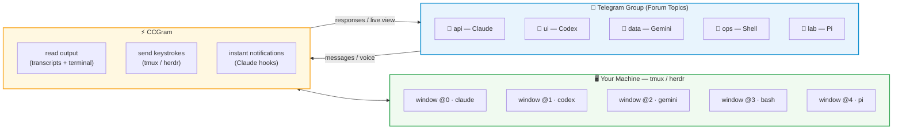
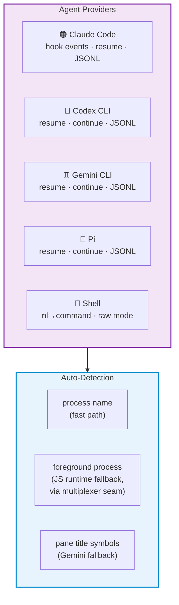

# CCGram — Control AI Coding Agents from Telegram

[](https://github.com/alexei-led/ccgram/actions/workflows/ci.yml)
[](https://pypi.org/project/ccgram/)
[](https://pypi.org/project/ccgram/)
[](https://pypi.org/project/ccgram/)
[](https://pypi.org/project/ccgram/)
[](LICENSE)
[](https://github.com/astral-sh/ruff)

**Control AI coding agents from your phone.** CCGram bridges Telegram to your terminal multiplexer ([tmux](https://github.com/tmux/tmux) by default, or [herdr](https://github.com/ogulcancelik/herdr)) — monitor output, respond to prompts, and manage multiple sessions without touching your computer. Supports [Claude Code](https://docs.anthropic.com/en/docs/claude-code), [Codex CLI](https://github.com/openai/codex), [Gemini CLI](https://github.com/google-gemini/gemini-cli), [Pi](https://pi.dev), and plain shell sessions.

---

## Why CCGram?

AI coding agents run in your terminal. When you step away — commuting, on the couch, or just away from your desk — the session keeps working, but you lose visibility and control.

CCGram fixes this. It operates on your terminal multiplexer, not any agent SDK. Your agent process stays exactly where it is, in a multiplexer window on your machine. CCGram reads its output and sends keystrokes to it. This means:

- **Desktop to phone, mid-conversation** — walk away and keep monitoring from Telegram
- **Phone back to desktop, anytime** — attach to your terminal session and you're back with full scrollback
- **Multiple sessions in parallel** — each Telegram topic maps to a separate window, each running a different agent

Other Telegram bots wrap agent SDKs into isolated API sessions that can't be resumed in your terminal. CCGram is a thin control layer over your terminal multiplexer — the terminal stays the source of truth.

---

## How It Works



Each Telegram Forum topic binds to one multiplexer window. Messages you type are sent as keystrokes to the pane; responses are parsed from session transcripts and delivered back as Telegram messages.

---

## Features

### Session Control

- **Topic-per-agent** — each Telegram Forum topic is one multiplexer window running one agent CLI
- **Git worktree topics** — when a new topic's directory is an eligible git repo, you can spin the agent up in a fresh worktree on a new branch (suggested `ccg/<topic-title>`, one-tap confirm or edit the name) instead of the current branch; non-git directories see the unchanged flow
- **Interactive prompts** — AskUserQuestion, ExitPlanMode, and Permission dialogs rendered as inline keyboards
- **Slash commands** — provider-aware menu (Claude `/cost`, Codex `/status`, Gemini `/chat`, Pi `/new`, `/compact`, `/scoped_models`, etc.); Pi also supports `/followup <message>` to queue Pi's Alt+Enter follow-up message; mismatched commands report errors
- **Voice messages** — transcribed via Whisper API (OpenAI/Groq), shown with **Send / Discard** buttons before forwarding
- **Multi-pane support** — auto-detects blocked panes in agent teams, surfaces prompts as alerts; `/panes` for overview
- **Terminal screenshots** — capture the current pane (or any specific pane) as a readable PNG of the current viewport, with ANSI color
- **Last reply** (`/last`, 📄 **Last** button) — resends the most recent assistant reply (AI providers, from the transcript) or last command+output (shell topics); long responses overflow to a `.txt` attachment instead of a giant image
- **Terminal live view** — auto-refreshing screenshots every 5 seconds via **Live** button or `/live` command; content-hash gating skips edits when nothing changed; auto-stops after timeout (configurable)
- **File delivery** (`/send`) — send workspace files to Telegram: exact path (`/send docs/arch.png`), glob (`/send *.png`), substring search (`/send arch`), or interactive browser (`/send`). Project-scoped with security filtering (hidden files, credentials, gitignored, >50 MB denied)
- **Action toolbar** (`/toolbar`) — provider-specific inline buttons. Row 1 is universal (Screenshot, Ctrl-C, Live). Row 2 varies per provider: Claude (Mode, Think, Esc), Codex (Esc, Tab, Mode), Gemini (Mode, YOLO, Esc), Pi (Esc, Tab, π Model), Shell (Enter, EOF, Suspend). Claude/Codex/Gemini/Pi add a universal navigation row (Up, Enter, Down). The final row is Last, Get File, Close (Shell folds Esc in: Last, Get File, Esc, Close). Customize via `~/.ccgram/toolbar.toml`
- **Picker hints** — when you forward a slash command that opens a modal in-TUI picker (e.g. `/model`, `/login`, `/theme`), the topic reply suggests using `/toolbar` to drive the picker with arrow keys
- **Remote Control** — 📡 topic badge when RC is active; activate by forwarding `/remote-control` (or `/rc`) to the agent. Claude's `/remote-control` is silent on outcome, so ccgram probes the pane afterward and posts the result (sharing URL on success, "unavailable", or failure) as a single status reply (Claude only)

### Real-Time Monitoring

- **Full status context** — status line shows what the agent is actually doing ("📝 Writing tests for auth module"), not a generic label
- **Configurable topic emoji color scheme** — `CCGRAM_STATUS_MODE=system` (default, green = agent working) or `user` (green = idle, ready for input) — pick the convention that matches how you scan the topic list
- **Completion summaries** — when an agent finishes, a single-line LLM summary of what was accomplished edits the Ready message in-place (~1-2s delay; static enriched Ready appears immediately)
- **Enriched Ready message** — task checklist, turn count, and last status shown on completion
- **Tool results** — tool use/result pairs, thinking content, Bash exit codes, and error/success indicators in batched output
- **Tool-call visibility toggle** — `tool_use`/`tool_result` messages are shown by default; `CCGRAM_HIDE_TOOL_CALLS=true` suppresses them globally and `/toolcalls` cycles per-window (`default → shown → hidden`). Hook events (Stop, errors, subagent updates) bypass the gate
- **Entity-based formatting** — markdown converted to plain text + MessageEntity offsets; automatic plain text fallback, no parse errors

### Session Management

- **Directory browser** — create sessions from Telegram by navigating your file system
- **Auto-sync** — create a multiplexer window manually and the bot auto-creates a matching topic
- **Recovery** — Fresh / Continue / Resume keyboard when a session dies (buttons adapt per provider)
- **Message history** — paginated browsing via `/history`
- **Sessions dashboard** — `/sessions` shows all active sessions with status and kill buttons
- **Persistent state** — bindings and read offsets survive bot restarts

### Multi-Provider Support



- **Per-topic provider** — different topics can use different agents simultaneously
- **Auto-detect** — externally created windows are detected via process name; when the pane command is a JS runtime wrapper (node, bun), the foreground process is inspected via the multiplexer backend (tmux uses `ps -t <tty>`, herdr reads `pane process-info`)

### Shell Provider

- **Chat-first** — type natural language → LLM generates a shell command → approve with one tap → output streams back
- **Raw mode** — prefix with `!` to bypass the LLM and send commands directly
- **Voice-to-command** — voice messages transcribed via Whisper, then routed through the LLM
- **Dangerous command detection** — extra confirmation step before running destructive commands
- **BYOK LLM** — OpenAI, Anthropic, xAI, DeepSeek, Groq, Ollama (zero new dependencies)

---

## Quick Start

### Prerequisites

- **Python 3.14+**
- **tmux** — installed and in PATH (default backend; set `CCGRAM_MULTIPLEXER=herdr` to use herdr instead)
- **At least one agent CLI** — `claude` (default), `codex`, `gemini`, or `pi` installed and authenticated (or use `shell` with no extra install)

### Install

```bash
uv tool install ccgram          # recommended
pipx install ccgram             # pipx
brew install alexei-led/tap/ccgram  # Homebrew (macOS)
```

### Configure

1. Create a Telegram bot via [@BotFather](https://t.me/BotFather)
2. In BotFather settings:
   - **Allow Groups**: On
   - **Group Privacy**: Off _(required to see all topic messages)_
   - **Topics**: On
3. Add the bot to a Telegram group with Topics enabled
4. **Promote the bot to Administrator** with **Create Topics** and **Pin Messages** permissions
5. Create `~/.ccgram/.env`:

```ini
TELEGRAM_BOT_TOKEN=your_bot_token_here
ALLOWED_USERS=your_telegram_user_id
CCGRAM_GROUP_ID=your_telegram_group_id
```

> Get your user ID from [@userinfobot](https://t.me/userinfobot). Get the group ID via [@RawDataBot](https://t.me/RawDataBot) (prefix the Peer ID with `-100`).

### Install Claude Hooks (Claude Code only)

```bash
ccgram hook --install
```

Registers Claude Code hooks for automatic session tracking, instant interactive UI detection, API error alerting, and subagent/team notifications. Not needed for Codex, Gemini, or Pi.

> If hooks are missing, ccgram warns at startup with the fix command. Hooks are optional — terminal scraping works as fallback.

### Run

```bash
ccgram
```

Open your Telegram group, create a new topic, send a message — a directory browser appears. Pick a project directory, choose your agent (Claude, Codex, Gemini, Pi, or Shell), choose session mode (`✅ Standard` or `🚀 YOLO`), and you're connected.

---

## Configuration Reference

| Variable / Flag                | Default                        | Description                                                                                                               |
| ------------------------------ | ------------------------------ | ------------------------------------------------------------------------------------------------------------------------- |
| `TELEGRAM_BOT_TOKEN`           | _(required)_                   | Bot token from @BotFather (env only)                                                                                      |
| `ALLOWED_USERS`                | _(required)_                   | Comma-separated Telegram user IDs                                                                                         |
| `CCGRAM_DIR`                   | `~/.ccgram`                    | Config and state directory                                                                                                |
| `CCGRAM_PROVIDER`              | `claude`                       | Default provider (`claude`, `codex`, `gemini`, `pi`, `shell`)                                                             |
| `CCGRAM_<NAME>_COMMAND`        | _(from provider)_              | Override launch command per provider                                                                                      |
| `CCGRAM_MULTIPLEXER`           | `tmux`                         | Terminal multiplexer backend: `tmux` (default) or `herdr` ([setup](docs/guides.md#herdr-backend-alternative-multiplexer)) |
| `CCGRAM_GROUP_ID`              | _(all groups)_                 | Restrict to one Telegram group                                                                                            |
| `CCGRAM_STATUS_MODE`           | `system`                       | Topic emoji color scheme: `system` (green=working) or `user` (green=ready)                                                |
| `CCGRAM_HIDE_TOOL_CALLS`       | `false`                        | Set `true` to hide `tool_use`/`tool_result` messages globally (shown by default)                                          |
| `CCGRAM_LLM_PROVIDER`          | _(disabled)_                   | LLM for shell command generation + completion summaries                                                                   |
| `CCGRAM_LLM_API_KEY`           | _(empty)_                      | LLM API key (env only)                                                                                                    |
| `CCGRAM_WHISPER_PROVIDER`      | _(disabled)_                   | Whisper provider for voice transcription (`openai`, `groq`)                                                               |
| `CCGRAM_TTS_PROVIDER`          | _(disabled)_                   | TTS backend for voice replies: `edge` (free, no key) or `openai`. `edge` requires `pip install ccgram[tts]`               |
| `CCGRAM_TTS_VOICE`             | `en-US-EmmaMultilingualNeural` | Voice name. For `edge`: any edge-tts voice. For `openai`: `alloy`, `nova`, `shimmer`, etc.                                |
| `CCGRAM_TTS_MODEL`             | `gpt-4o-mini-tts`              | OpenAI TTS model. Only used when `CCGRAM_TTS_PROVIDER=openai`                                                             |
| `CCGRAM_TTS_API_KEY`           | _(empty)_                      | API key for OpenAI TTS. Falls back to `OPENAI_API_KEY` if unset                                                           |
| `CCGRAM_LIVE_VIEW_INTERVAL`    | `5`                            | Live view refresh interval in seconds                                                                                     |
| `CCGRAM_LIVE_VIEW_TIMEOUT`     | `300`                          | Live view auto-stop timeout in seconds                                                                                    |
| `CCGRAM_SEND_SEARCH_DEPTH`     | `5`                            | Max directory depth for `/send` file search                                                                               |
| `CCGRAM_SEND_MAX_RESULTS`      | `50`                           | Max file results returned by `/send` search                                                                               |
| `AUTOCLOSE_DONE_MINUTES`       | `30`                           | Auto-close completed topics after N minutes                                                                               |
| `AUTOCLOSE_DEAD_MINUTES`       | `10`                           | Auto-close dead sessions after N minutes                                                                                  |
| `CCGRAM_PANE_LIFECYCLE_NOTIFY` | `false`                        | Default for per-window pane create/close notifications                                                                    |
| `CCGRAM_MINIAPP_BASE_URL`      | _(disabled)_                   | Externally reachable HTTPS URL for the Mini App dashboard                                                                 |
| `CCGRAM_MINIAPP_HOST`          | `127.0.0.1`                    | Local aiohttp bind host for the Mini App server                                                                           |
| `CCGRAM_MINIAPP_PORT`          | `8765`                         | Local aiohttp bind port for the Mini App server                                                                           |

Full reference: **[docs/guides.md](docs/guides.md#configuration)**

---

## Mini App Dashboard (Optional)

CCGram ships an optional web dashboard that opens from a Telegram inline button and runs inside Telegram's WebApp container. Three surfaces are available in v3.0:

- **Live terminal** — xterm.js stream of the bound multiplexer pane (read-only)
- **Transcript** — paginated session history with full-text search
- **Multi-pane grid** — every pane in the window in one view; click to focus

The Mini App is **disabled by default**. When `CCGRAM_MINIAPP_BASE_URL` is unset, neither the HTTP server nor the dashboard button are exposed.

### Enable

1. Set the three Mini App env vars:

   ```ini
   CCGRAM_MINIAPP_BASE_URL=https://ccgram.example.com
   CCGRAM_MINIAPP_HOST=127.0.0.1
   CCGRAM_MINIAPP_PORT=8765
   ```

2. Terminate TLS in front of the local aiohttp server (cloudflared, caddy, or nginx). The server listens on plain HTTP at `MINIAPP_HOST:MINIAPP_PORT`; the public domain in `MINIAPP_BASE_URL` must serve it over HTTPS — Telegram WebApps refuse plain HTTP.
3. In [@BotFather](https://t.me/BotFather):
   - `/setdomain` — register your domain
   - `/newapp` — create a Mini App entry pointing to the same URL
4. Restart `ccgram`. A new "🪟 Dashboard" button appears on the status bubble.

Tokens are HMAC-signed with the bot token, scoped to a single window + user, and expire on a short clock. There is no cross-window access — every API route validates the token on every call.

### Reverse-proxy snippet (caddy)

```caddy
ccgram.example.com {
  reverse_proxy 127.0.0.1:8765
}
```

For nginx, ensure `proxy_http_version 1.1` and the standard `Upgrade`/`Connection` headers are forwarded so the live terminal websocket works.

---

---

## Development

```bash
git clone https://github.com/alexei-led/ccgram.git
cd ccgram
uv sync --extra dev

make check        # fmt + lint + typecheck + unit + integration tests
make test-e2e     # E2E tests (requires agent CLIs, see docs/guides.md)
```

---

## Documentation

- **[docs/guides.md](docs/guides.md)** — CLI reference, configuration, voice messages, multi-instance setup, session recovery, testing
- **[docs/providers.md](docs/providers.md)** — Provider details (Claude, Codex, Gemini, Pi, Shell), session modes, LLM configuration, custom launch commands

---

## Migrating from ccbot

CCGram was previously named `ccbot`. If upgrading from v1.x:

```bash
pip install ccgram          # or: brew install alexei-led/tap/ccgram
mv ~/.ccbot ~/.ccgram       # migrate config directory
# Update CCBOT_* env vars → CCGRAM_* (old vars still work with deprecation warnings)
ccgram hook --install       # re-install hooks
```

---

## Acknowledgments

Inspired by [ccbot](https://github.com/six-ddc/ccbot) by [six-ddc](https://github.com/six-ddc), the original Telegram-to-Claude-Code bridge. Thanks for the spark.

## License

[MIT](LICENSE)
