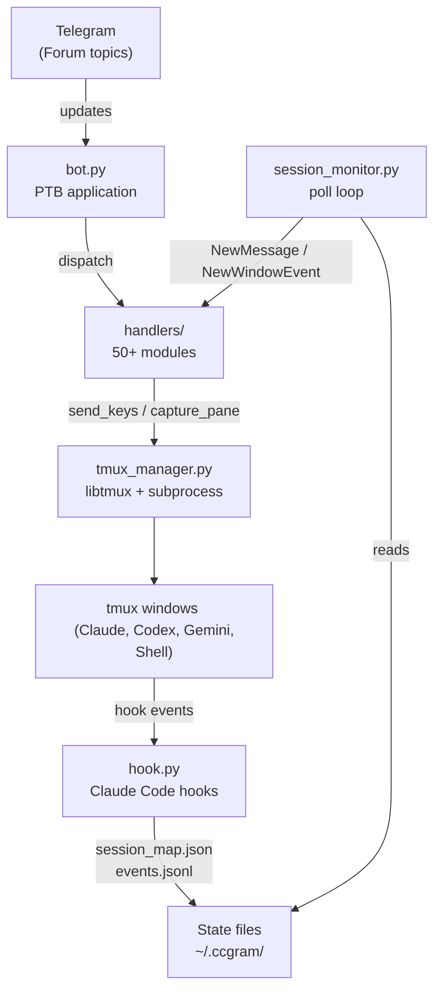
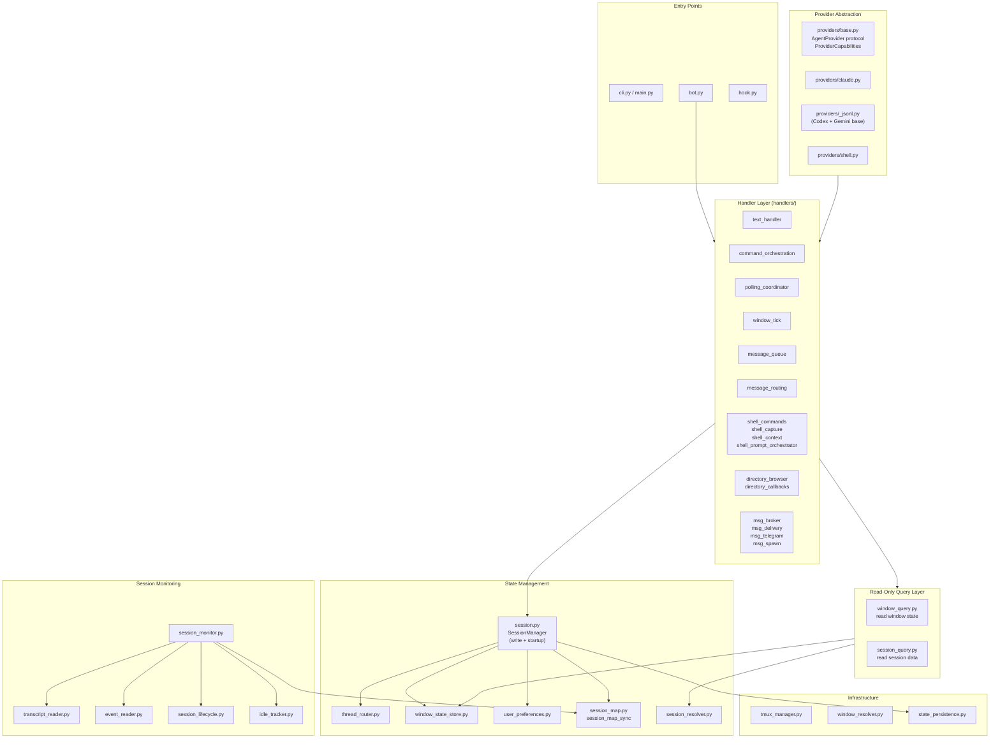
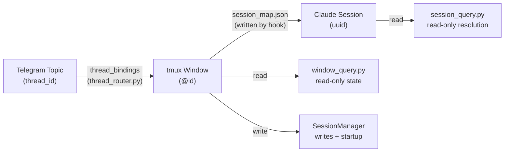
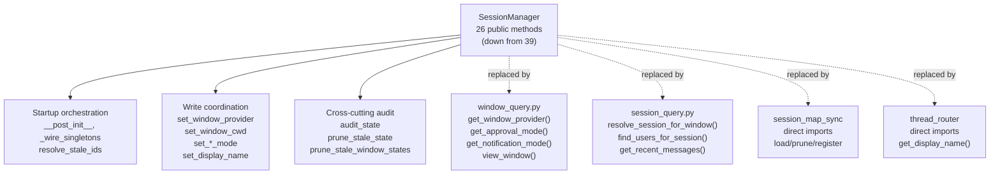
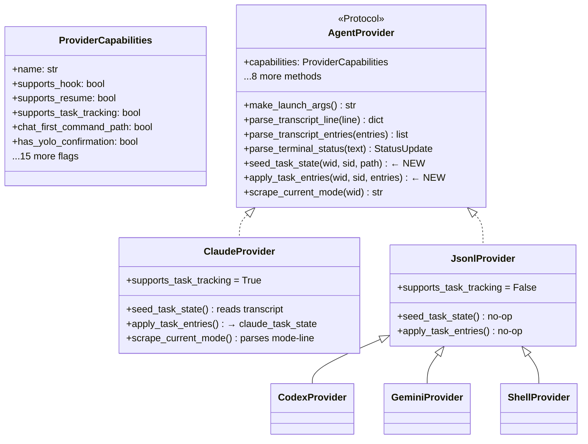
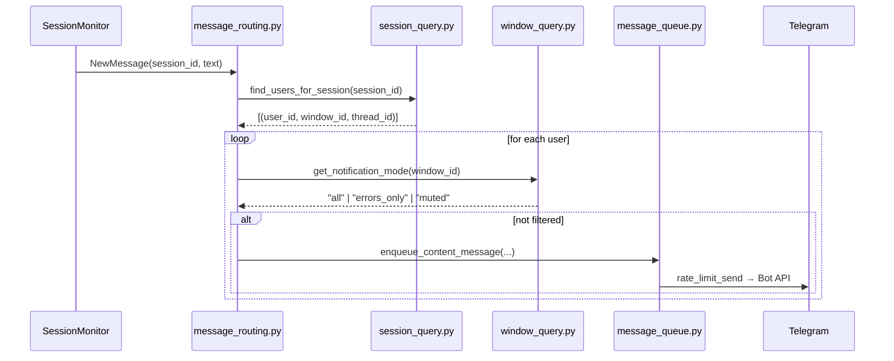
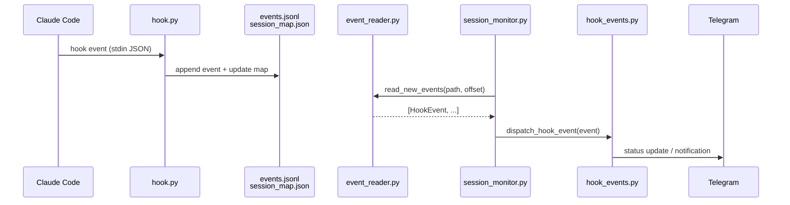
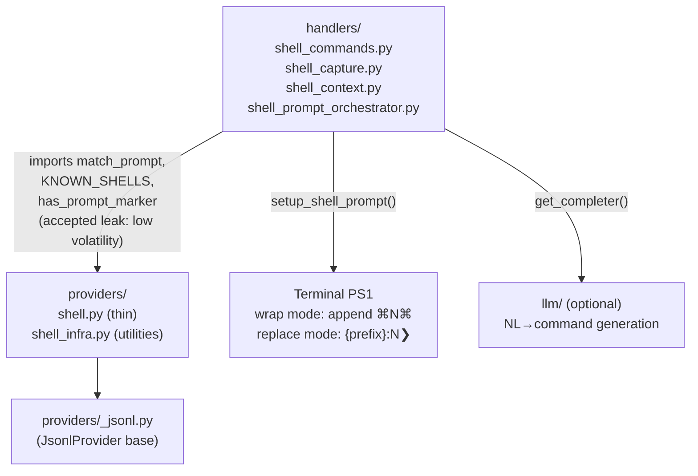
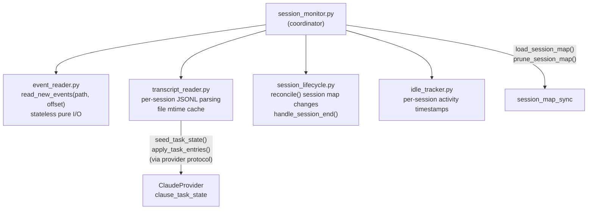
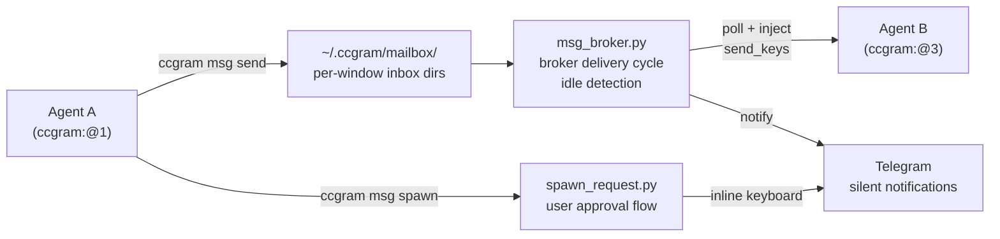

# ccgram Architecture

Generated from code state 2026-04-16 (post modularity round 3).

## System Overview

ccgram maps each Telegram Forum topic to one tmux window running one agent CLI (Claude Code, Codex, Gemini, or Shell). All internal routing is keyed by tmux window ID (`@0`, `@12`).

## Module Layers

## State Flow: Topic → Window → Session

## SessionManager Responsibilities (post round 3)

## Provider Protocol

## Message Routing Flow

## Hook Event Flow

## Shell Provider Architecture

## Session Monitoring Architecture

## Inter-Agent Messaging

## Key Design Decisions

| Decision                                | Rationale                                                                                                                                  |
| --------------------------------------- | ------------------------------------------------------------------------------------------------------------------------------------------ |
| Window ID-centric routing (`@0`, `@12`) | Unique within tmux server; window names are display-only                                                                                   |
| Hook-based event system                 | Instant stop/done detection without terminal polling                                                                                       |
| `window_query.py` decoupling layer      | Handlers read window state without importing `SessionManager`                                                                              |
| `session_query.py` decoupling layer     | Handlers resolve sessions without importing `SessionManager`                                                                               |
| Provider protocol with capability flags | Gate UX features without `if provider == "claude"` checks                                                                                  |
| `supports_task_tracking` capability     | `transcript_reader` is provider-agnostic; Claude implements task state                                                                     |
| Session map direct imports              | Lifecycle handlers use `session_map_sync` directly; no facade needed                                                                       |
| File-based mailbox                      | Agents exchange messages via `~/.ccgram/mailbox/`; broker injects via `send_keys`                                                          |
| Shell leak accepted                     | `match_prompt`, `KNOWN_SHELLS` imports in shell handlers are low-volatility supporting domain — balance rule satisfied by `NOT VOLATILITY` |
