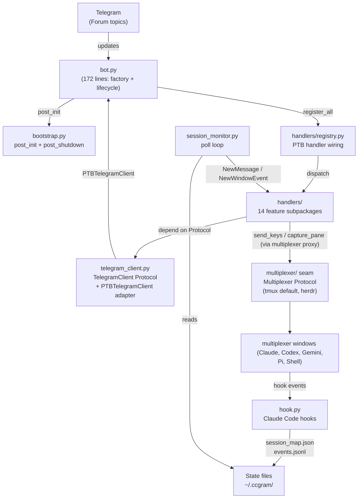
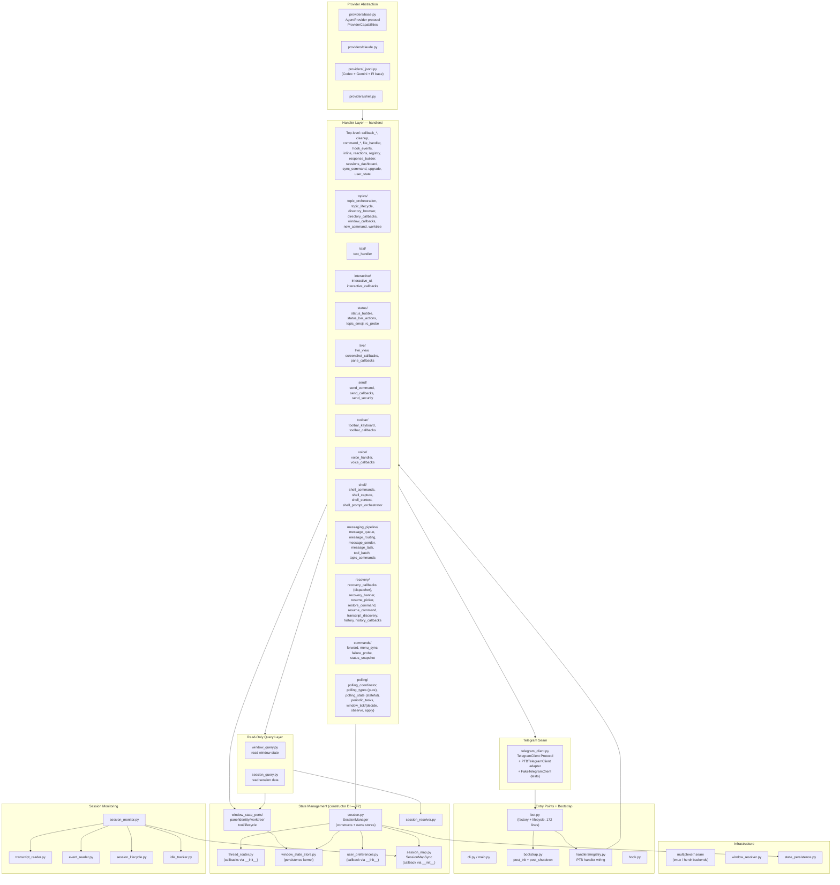
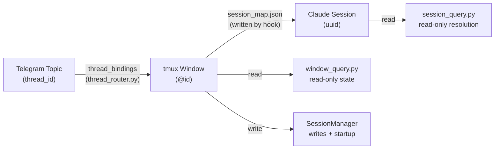
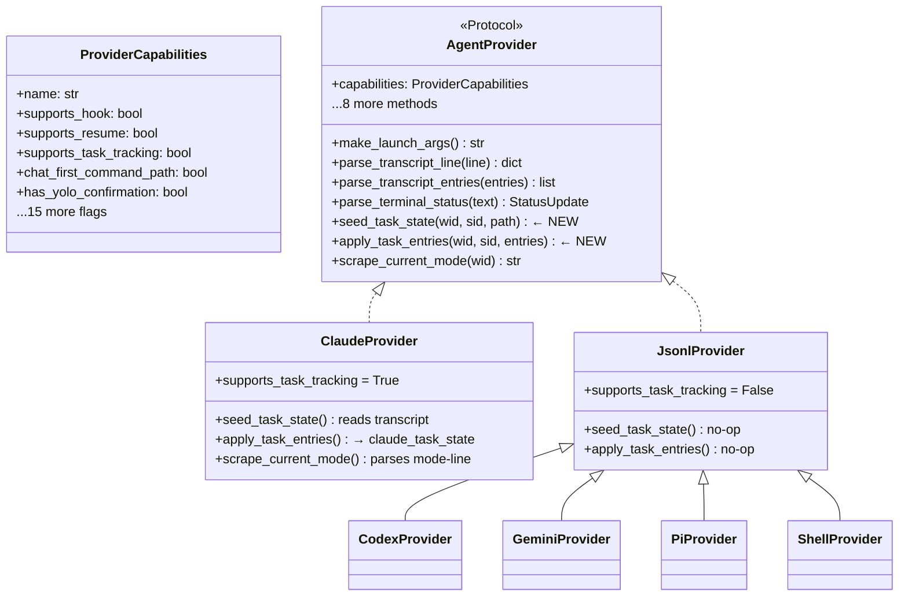
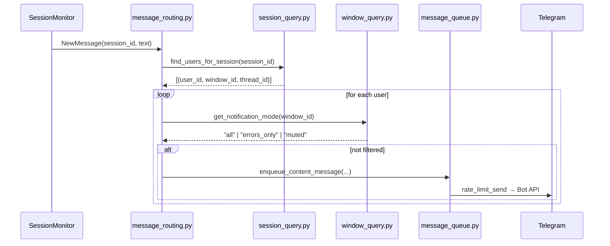
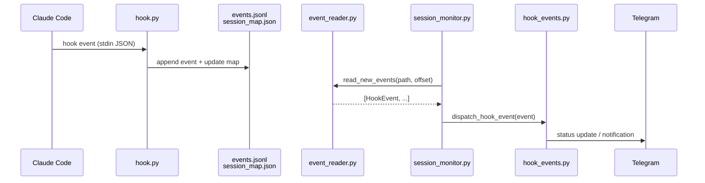
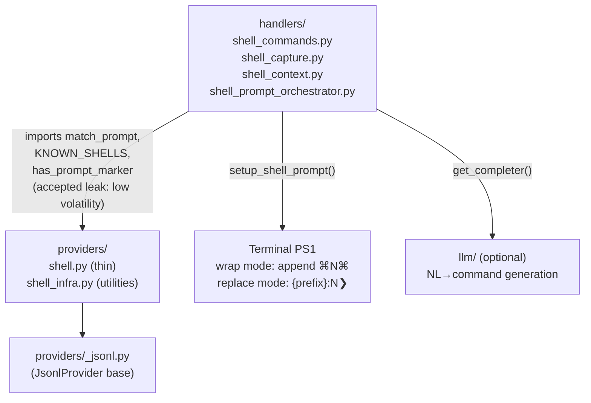
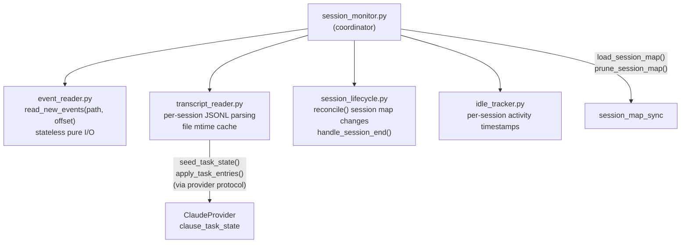

# ccgram Architecture

Generated from code state 2026-05-21.

## System Overview

ccgram maps each Telegram Forum topic to one terminal-multiplexer window running one agent CLI (Claude Code, Codex, Gemini, Pi, or Shell). All internal routing is keyed by window ID (`@0`, `@12`). Multiplexer access goes through the `multiplexer/` seam (`Multiplexer` Protocol); tmux is the default backend and herdr is selectable via `CCGRAM_MULTIPLEXER=herdr`.

## Module Layers

## State Flow: Topic → Window → Session

## SessionManager Responsibilities

`SessionManager` constructs and owns the four state stores (`WindowStateStore`, `ThreadRouter`, `UserPreferences`, `SessionMapSync`) via constructor DI with explicit `schedule_save` callbacks. Its public surface is now small: startup orchestration (`__post_init__`, `resolve_stale_ids`), write coordination (`set_window_provider`, `set_window_cwd`, `set_*_mode`, `set_display_name`), and cross-cutting audit (`audit_state`, `prune_stale_state`, `prune_stale_window_states`).

Read paths bypass `SessionManager`:

- `window_query.py` — `get_window_provider()`, `get_approval_mode()`, `get_notification_mode()`, `view_window()`; feature-shaped reads delegate to `window_state_ports/*`.
- `window_state_ports/` — `pane_state`, `identity_state`, `worktree_state`, `tool_state`, `lifecycle_state`. Frozen projection dataclasses for handlers and Mini App, plus cohesive feature writes (pane upsert/remove/lifecycle, worktree metadata, batch mode, tool-call visibility, origin). Provider/session identity writes still delegate to `SessionManager.set_window_provider`.
- `session_query.py` — `resolve_session_for_window()`, `find_users_for_session()`, `get_recent_messages()`.
- `session_map_sync` (direct imports) — `load/prune/register`.
- `thread_router` (direct imports) — `get_display_name()`.

`WindowStateStore` remains the single persistence kernel for `WindowState`. Handler and Mini App reads of window state go through `window_query` or `window_state_ports/*` — never raw `WindowState` fields. Boundary enforced by `tests/ccgram/test_window_state_access_audit.py` (raw feature-field access permitted only in `window_state_store.py`, `window_state_ports/*`, `session.py`, `window_query.py`, and serialization tests) and `tests/ccgram/test_query_layer_only_for_handlers.py` (write/admin allow-list).

## Provider Protocol

## Message Routing Flow

## Hook Event Flow

## Shell Provider Architecture

## Session Monitoring Architecture

## Key Design Decisions

| Decision                                | Rationale                                                                                                                                                                                                                                                                                                                                                                                                                                             |
| --------------------------------------- | ----------------------------------------------------------------------------------------------------------------------------------------------------------------------------------------------------------------------------------------------------------------------------------------------------------------------------------------------------------------------------------------------------------------------------------------------------- |
| Window ID-centric routing (`@0`, `@12`) | Unique within a tmux server; window names are display-only                                                                                                                                                                                                                                                                                                                                                                                            |
| Hook-based event system                 | Instant stop/done/notification detection without terminal polling; events appended to `events.jsonl` and consumed incrementally                                                                                                                                                                                                                                                                                                                       |
| `window_query` / `session_query`        | Handlers read window/session state via free functions, never importing `SessionManager`. Direct `session_manager.<attr>` in `handlers/**` is restricted to a documented write/admin allow-list                                                                                                                                                                                                                                                        |
| `window_state_ports/` feature ports     | `WindowStateStore` is the single persistence kernel; `window_state_ports/{pane,identity,worktree,tool,lifecycle}_state` are thin adapters exposing frozen projections plus cohesive feature writes. Raw `WindowState`-field access outside the kernel, the ports, `session.py`, `window_query.py`, and serialization tests fails `test_window_state_access_audit.py`. Provider identity writes still delegate to `SessionManager.set_window_provider` |
| Provider protocol with capability flags | Gate UX features (resume, continue, hooks, YOLO, mode scraping, RC, picker hints) without `if provider == "claude"` checks                                                                                                                                                                                                                                                                                                                            |
| `supports_task_tracking` capability     | `transcript_reader` is provider-agnostic; only Claude implements task state                                                                                                                                                                                                                                                                                                                                                                           |
| Tool-call visibility on `WindowState`   | Per-window `tool_call_visibility` (`default`/`shown`/`hidden`) gates `_handle_content_task` before batch eligibility; hook events bypass                                                                                                                                                                                                                                                                                                              |
| Status-mode color schemes               | `CCGRAM_STATUS_MODE` selects `system` (green = working) or `user` (green = ready) — only emoji rendering changes, not internal state names                                                                                                                                                                                                                                                                                                            |
| Gemini JSONL incremental reads          | Gemini CLI v0.40+ uses append-only JSONL; provider inherits `JsonlProvider` byte-offset reader, dedupes by message id and pending tool_use                                                                                                                                                                                                                                                                                                            |
| Viewport screenshots                    | `/screenshot` and 📷 capture the current viewport with ANSI color; live view uses the same viewport capture at a smaller font size. `/last` (📄 Last toolbar button) delivers the last assistant reply text (AI providers, from transcript) or last command+output block (shell) as a message or `.txt` attachment for overflow                                                                                                                       |
| Picker hints                            | `ProviderCapabilities.tui_picker_commands` lists modal-opening slash commands; `forward._picker_hint()` adds a hint pointing at `/toolbar` when one is forwarded, with the hint text adapted to the resolved `ToolbarLayout`                                                                                                                                                                                                                          |
| `handlers/` feature subpackages         | Handlers are grouped into 14 feature subpackages; each `__init__.py` re-exports the public surface                                                                                                                                                                                                                                                                                                                                                    |
| Constructor DI for stores               | `SessionManager` constructs `WindowStateStore`/`ThreadRouter`/`UserPreferences`/`SessionMapSync` with explicit `schedule_save` callbacks; no `_wire_singletons` and no silent unwired defaults — `register_*_callback` fails loud                                                                                                                                                                                                                     |
| `bot.py` is a factory + lifecycle only  | 172 lines; `handlers/registry.py` owns PTB handler wiring; `bootstrap.py` owns `post_init` (ordered: `register_provider_commands` → `verify_hooks_installed` → `wire_runtime_callbacks` → `start_session_monitor` → `start_status_polling` → `start_miniapp_if_enabled`) and `post_shutdown`                                                                                                                                                          |
| `window_tick/decide,observe,apply`      | Pure decision kernel (`decide.py`, zero deps on tmux/PTB/singletons) + pure observer (`observe.py`, `TickContext` out) + side-effect applier (`apply.py`); `decide_tick` is unit-tested without mocks                                                                                                                                                                                                                                                 |
| `TelegramClient` Protocol               | Handlers depend on `TelegramClient` not `telegram.Bot`; `PTBTelegramClient` adapts in production, `FakeTelegramClient` records in tests. Only `bot.py`, `bootstrap.py`, `handlers/registry.py`, `telegram_client.py`, `telegram_request.py`, `telegram_sender.py` import from `telegram.ext` at runtime                                                                                                                                               |
| Pure types vs stateful polling          | `polling_types.py` holds contracts (stdlib + `providers.base.StatusUpdate` only); `polling_state.py` holds strategies + module-level singletons; `decide.py` imports only from `polling_types`. Pinned by `test_polling_types_purity.py`                                                                                                                                                                                                              |
| Recovery split                          | `recovery_callbacks.py` is a thin dispatcher; `recovery_banner.py` owns dead-window banner UX; `resume_picker.py` owns the resume picker + transcript scan. `recovery/__init__.py` re-exports the public surface                                                                                                                                                                                                                                      |
| Commands subpackage                     | `handlers/commands/` mirrors the `shell/` pattern: `forward.py`, `menu_sync.py`, `failure_probe.py`, `status_snapshot.py`. `commands/__init__.py` hosts `commands_command` + `toolbar_command`                                                                                                                                                                                                                                                        |
| Lazy-import contract                    | In-function `Import`/`ImportFrom` must carry `# Lazy: <reason>` (or live inside `if TYPE_CHECKING:` / `_reset_*_for_testing`). `scripts/lint_lazy_imports.py` runs in `make lint`; cycle regressions caught by `tests/integration/test_import_no_cycles.py`                                                                                                                                                                                           |
