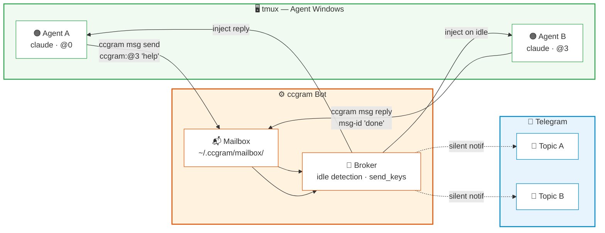
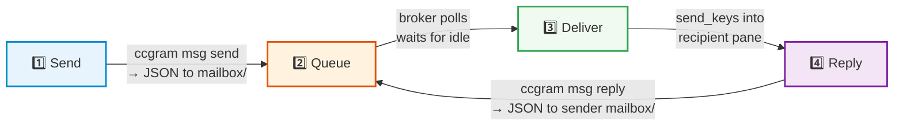

# Guides

## Upgrading

```bash
uv tool upgrade ccgram                # uv (recommended)
pipx upgrade ccgram                   # pipx
brew upgrade ccgram                   # Homebrew
```

## CLI Reference

```
ccgram                        # Start the bot
ccgram status                 # Show running state (no token needed)
ccgram doctor                 # Validate setup and diagnose issues
ccgram doctor --fix           # Auto-fix issues (install hook, kill orphans)
ccgram hook --install         # Install Claude Code hooks
ccgram hook --uninstall       # Remove all hooks
ccgram hook --status          # Check per-event hook installation status
ccgram --version              # Show version
ccgram -v                     # Run with debug logging
ccgram msg send <to> <body>   # Send inter-agent message
ccgram msg inbox              # Check incoming messages
ccgram msg list-peers         # Show active agent windows
```

## Local Dev in tmux

Recommended local development model:

- Run ccgram in a dedicated control window `ccgram:__main__`.
- Keep agent windows in the same `ccgram` tmux session.
- Restart by sending Ctrl-C to the control pane.

Use the helper script:

```bash
./scripts/restart.sh start      # fresh start; creates ccgram:__main__ if missing and installs Claude hooks
./scripts/restart.sh status     # show current command + last logs
./scripts/restart.sh restart    # sends Ctrl-C to control pane (supervisor restarts)
./scripts/restart.sh stop       # sends Ctrl-\ to control pane (supervisor exits)
```

Direct key behavior in the control pane (`ccgram:__main__`):

- `Ctrl-C`: restart ccgram.
- `Ctrl-\`: stop the local dev supervisor loop.

### Fresh Start Guide

If you are starting from scratch:

1. `cd /path/to/ccgram`
2. `./scripts/restart.sh start`
3. `tmux attach -t ccgram`
4. In another terminal (or another pane), open your agent windows in the same tmux session.

The `start` command creates the tmux session/window if they do not exist, installs or updates Claude hooks, and then launches the supervisor. No manual tmux bootstrap is required.

## Testing

CCGram has three test tiers:

| Tier        | Command                 | Time     | Requirements      |
| ----------- | ----------------------- | -------- | ----------------- |
| Unit        | `make test`             | ~10s     | None (all mocked) |
| Integration | `make test-integration` | ~7s      | tmux              |
| E2E         | `make test-e2e`         | ~3-4 min | tmux + agent CLIs |

`make check` runs unit + integration tests together with formatting, linting, and type checking.

### E2E Tests

End-to-end tests exercise the full lifecycle: inject fake Telegram updates → real PTB application → real tmux windows → real agent CLI processes → intercept Bot API responses. Each provider's tests are skipped automatically if its CLI is not installed.

**Prerequisites:**

- tmux installed and in PATH
- One or more agent CLIs installed and authenticated: `claude`, `codex`, `gemini`, `pi`

**Test coverage per provider:**

| Provider | Tests | Scenarios                                                                                                                                                    |
| -------- | ----- | ------------------------------------------------------------------------------------------------------------------------------------------------------------ |
| Claude   | 9     | Lifecycle, `/sessions`, `/screenshot`, `/help` forwarding, recovery (fresh + continue), status transitions, multi-topic isolation, notification mode cycling |
| Codex    | 3     | Lifecycle, command forwarding, recovery                                                                                                                      |
| Gemini   | 3     | Lifecycle, command forwarding, recovery                                                                                                                      |
| Pi       | —     | Unit + contract coverage only; no e2e lifecycle suite yet                                                                                                    |

**How it works:** The Bot API HTTP layer is mocked — fake `Update` objects are injected via `app.process_update()` and all outgoing API calls are intercepted and recorded for assertions. The tests drive through the full topic binding flow (directory browser → optional worktree picker → provider picker → mode select → window creation) and verify agent processes launch, messages are forwarded, and responses are delivered.

**Running:**

```bash
make test-e2e                                         # All providers
uv run pytest tests/e2e/test_claude_lifecycle.py -v   # Claude only
uv run pytest tests/e2e/test_codex_lifecycle.py -v    # Codex only
uv run pytest tests/e2e/test_gemini_lifecycle.py -v   # Gemini only
# Pi: covered by unit + contract tests in tests/ccgram/providers/test_pi.py
```

The tests create an isolated `ccgram-e2e` tmux session that does not interfere with a running `ccgram` instance. Safe to run from a tmux window.

## Configuration

All settings accept both CLI flags and environment variables. CLI flags take precedence. `TELEGRAM_BOT_TOKEN` is env-only for security (flags are visible in `ps`).

| Variable / Flag                                      | Default                        | Description                                                                                          |
| ---------------------------------------------------- | ------------------------------ | ---------------------------------------------------------------------------------------------------- |
| `TELEGRAM_BOT_TOKEN`                                 | _(required)_                   | Bot token from @BotFather (env only)                                                                 |
| `ALLOWED_USERS` / `--allowed-users`                  | _(required)_                   | Comma-separated Telegram user IDs                                                                    |
| `CCGRAM_DIR` / `--config-dir`                        | `~/.ccgram`                    | Config and state directory                                                                           |
| `CLAUDE_CONFIG_DIR` / `--claude-config-dir`          | `~/.claude`                    | Override Claude config directory (for wrappers like ce, cc-mirror)                                   |
| `TMUX_SESSION_NAME` / `--tmux-session`               | `ccgram`                       | tmux session name                                                                                    |
| `CCGRAM_PROVIDER` / `--provider`                     | `claude`                       | Default agent provider (`claude`, `codex`, `gemini`, `pi`, `shell`)                                  |
| `CCGRAM_<NAME>_COMMAND`                              | _(from provider)_              | Per-provider launch command (env only, see below)                                                    |
| `CCGRAM_PROMPT_MODE` / `--prompt-mode`               | `wrap`                         | Shell prompt marker mode (`wrap` or `replace`)                                                       |
| `CCGRAM_SHOW_HIDDEN_DIRS` / `--show-hidden-dirs`     | `false`                        | Show dot-directories in directory browser                                                            |
| `CCGRAM_GROUP_ID` / `--group-id`                     | _(all groups)_                 | Restrict to one Telegram group                                                                       |
| `CCGRAM_INSTANCE_NAME` / `--instance-name`           | hostname                       | Display label for this instance                                                                      |
| `CCGRAM_LOG_LEVEL` / `--log-level`                   | `INFO`                         | Logging level (DEBUG, INFO, WARNING, ERROR)                                                          |
| `MONITOR_POLL_INTERVAL` / `--monitor-interval`       | `2.0`                          | Seconds between transcript polls                                                                     |
| `AUTOCLOSE_DONE_MINUTES` / `--autoclose-done`        | `30`                           | Auto-close done topics after N minutes (0=off)                                                       |
| `AUTOCLOSE_DEAD_MINUTES` / `--autoclose-dead`        | `10`                           | Auto-close dead sessions after N minutes (0=off)                                                     |
| `CCGRAM_WHISPER_PROVIDER` / `--whisper-provider`     | _(empty)_                      | Whisper provider: `openai`, `groq`, or empty to disable                                              |
| `CCGRAM_WHISPER_API_KEY`                             | _(empty)_                      | API key (env only); falls back to OPENAI_API_KEY/GROQ_API_KEY                                        |
| `CCGRAM_WHISPER_BASE_URL` / `--whisper-base-url`     | _(provider default)_           | Custom OpenAI-compatible endpoint URL                                                                |
| `CCGRAM_WHISPER_MODEL` / `--whisper-model`           | _(provider default)_           | Model override (e.g., `whisper-large-v3-turbo`)                                                      |
| `CCGRAM_WHISPER_LANGUAGE` / `--whisper-language`     | _(auto-detect)_                | Force language code (e.g., `en`, `zh`)                                                               |
| `CCGRAM_LLM_PROVIDER`                                | _(empty = disabled)_           | LLM provider for shell command generation                                                            |
| `CCGRAM_LLM_API_KEY`                                 | _(empty)_                      | API key for LLM provider (env only)                                                                  |
| `CCGRAM_LLM_BASE_URL`                                | _(from provider)_              | Custom LLM API endpoint                                                                              |
| `CCGRAM_LLM_MODEL`                                   | _(from provider)_              | LLM model override                                                                                   |
| `CCGRAM_LLM_TEMPERATURE`                             | `0.1`                          | LLM sampling temperature (0 = deterministic)                                                         |
| `CCGRAM_LIVE_VIEW_INTERVAL` / `--live-view-interval` | `5`                            | Live view refresh interval in seconds (min 1)                                                        |
| `CCGRAM_LIVE_VIEW_TIMEOUT` / `--live-view-timeout`   | `300`                          | Live view auto-stop timeout in seconds (min 1)                                                       |
| `CCGRAM_STATUS_MODE` / `--status-mode`               | `system`                       | Topic emoji color scheme: `system` (green=working) or `user` (green=ready)                           |
| `CCGRAM_HIDE_TOOL_CALLS` / `--hide-tool-calls`       | `false`                        | Set `true` to globally hide `tool_use`/`tool_result` messages (per-window override via `/toolcalls`) |
| `CCGRAM_PROMPT_MODE` / `--prompt-mode`               | `wrap`                         | Shell prompt marker: `wrap` (append `⌘N⌘`) or `replace` (legacy `{prefix}:N❯`)                       |
| `CCGRAM_PROMPT_MARKER`                               | `ccgram`                       | Marker prefix used only by `replace` mode                                                            |
| `CCGRAM_PANE_LIFECYCLE_NOTIFY`                       | `false`                        | Default for per-window pane create/close notifications (toggle via `/panes`)                         |
| `CCGRAM_SHOW_HIDDEN_DIRS` / `--show-hidden-dirs`     | `false`                        | Show dot-directories in the directory browser                                                        |
| `CCGRAM_SEND_SEARCH_DEPTH`                           | `5`                            | Max directory depth for `/send` file search                                                          |
| `CCGRAM_SEND_MAX_RESULTS`                            | `50`                           | Max file results returned by `/send` search                                                          |
| `CCGRAM_TOOLBAR_CONFIG`                              | `~/.ccgram/toolbar.toml`       | Path to custom toolbar TOML; falls back to built-in defaults if missing                              |
| `CCGRAM_STATUS_POLL_INTERVAL`                        | `1.0`                          | Status polling interval in seconds (min 0.5)                                                         |
| `CCGRAM_MINIAPP_BASE_URL`                            | _(disabled)_                   | Externally reachable HTTPS URL for the Mini App dashboard                                            |
| `CCGRAM_MINIAPP_HOST`                                | `127.0.0.1`                    | Local bind host for the Mini App aiohttp server                                                      |
| `CCGRAM_MINIAPP_PORT`                                | `8765`                         | Local bind port for the Mini App aiohttp server                                                      |
| `CCGRAM_TTS_PROVIDER`                                | _(disabled)_                   | TTS backend for voice replies: `edge` (free) or `openai`                                             |
| `CCGRAM_TTS_VOICE`                                   | `en-US-EmmaMultilingualNeural` | Voice name                                                                                           |
| `CCGRAM_TTS_MODEL`                                   | `gpt-4o-mini-tts`              | OpenAI TTS model (only used when `CCGRAM_TTS_PROVIDER=openai`)                                       |
| `CCGRAM_TTS_API_KEY`                                 | _(empty)_                      | API key for OpenAI TTS; falls back to `OPENAI_API_KEY`                                               |

## Topic Emoji Color Scheme

Topic emojis change color to reflect agent status. The mapping between color and meaning is configurable:

| Mode               | 🟢 Green                        | 🟡 Yellow        | When to pick                       |
| ------------------ | ------------------------------- | ---------------- | ---------------------------------- |
| `system` (default) | agent is working                | agent is idle    | "is anything running right now?"   |
| `user`             | agent is idle / ready for input | agent is working | "does anything need my attention?" |

Set globally via `CCGRAM_STATUS_MODE=user` or `--status-mode user`. Invalid values fall back to `system`.

## Tool-Call Visibility

By default, `tool_use` and `tool_result` events from Claude/Codex/Gemini are forwarded to Telegram. You can suppress them globally or per-window when they create more noise than signal (e.g., during heavy file or grep work).

- **Global**: `CCGRAM_HIDE_TOOL_CALLS=true` or `--hide-tool-calls` makes the global default `hidden`.
- **Per-window**: `/toolcalls` in a topic cycles `default → shown → hidden`. The per-window setting always wins over the global default.

Hook events (Stop, StopFailure, SubagentStart/Stop, TaskCompleted, TeammateIdle) are **never** suppressed — they bypass the gate so you still see what matters.

## Voice Message Transcription

Send voice messages in Telegram and have them transcribed and forwarded to the agent.

### Setup

Set a whisper provider and API key:

```ini
# Groq (fast, generous free tier)
CCGRAM_WHISPER_PROVIDER=groq
GROQ_API_KEY=gsk_xxxxxxxx

# Or OpenAI
CCGRAM_WHISPER_PROVIDER=openai
OPENAI_API_KEY=sk-xxxxxxxx

# Or any OpenAI-compatible endpoint
CCGRAM_WHISPER_PROVIDER=openai
CCGRAM_WHISPER_API_KEY=your_key
CCGRAM_WHISPER_BASE_URL=http://localhost:8000/v1
```

Optional overrides:

```ini
CCGRAM_WHISPER_MODEL=whisper-large-v3-turbo   # default depends on provider
CCGRAM_WHISPER_LANGUAGE=en                     # omit for auto-detect
```

### How It Works

1. Send a voice message in a topic bound to an agent
2. Bot downloads the audio (max 25 MB) and sends it to the Whisper API
3. Transcription appears with **✓ Send to agent** and **✗ Discard** buttons
4. Tap **Send** to forward the text to the agent, or **Discard** to cancel

In shell topics, voice transcriptions are automatically routed through the LLM for command generation (if `CCGRAM_LLM_PROVIDER` is set). In agent topics, the transcribed text is sent directly to the agent.

Leave `CCGRAM_WHISPER_PROVIDER` empty (the default) to disable voice transcription.

## Tmux Session Auto-Detection

When ccgram starts inside an existing tmux session, it auto-detects the session name and attaches to it instead of creating a new `ccgram` session. This is useful when you already have a tmux session with agent windows.

**How it works:**

1. If `$TMUX` is set and no `--tmux-session` flag is given, ccgram detects the current session name
2. The bot's own tmux window is automatically excluded from the window list
3. If another ccgram instance is already running in the same session, startup is refused

**Override:** `--tmux-session=NAME` or `TMUX_SESSION_NAME=NAME` always takes precedence over auto-detection.

**Outside tmux:** Behavior is unchanged — ccgram creates a `ccgram` session with a `__main__` placeholder window.

| Scenario                         | Behavior                                            |
| -------------------------------- | --------------------------------------------------- |
| Outside tmux, no flags           | Creates `ccgram` session + `__main__` window        |
| Outside tmux, `--tmux-session=X` | Creates/attaches `X` + `__main__` window            |
| Inside tmux, no flags            | Auto-detects session, skips own window, no creation |
| Inside tmux, `--tmux-session=X`  | Overrides auto-detect, uses `X`                     |

## Auto-Close Behavior

CCGram automatically closes Telegram topics when sessions end, reducing clutter:

- **Done topics** (`--autoclose-done`, default: 30 min) — When Claude finishes a task and the session completes normally, the topic auto-closes after 30 minutes.
- **Dead sessions** (`--autoclose-dead`, default: 10 min) — When a Claude process crashes or the tmux window is killed externally, the topic auto-closes after 10 minutes.

Set to `0` to disable:

```bash
ccgram --autoclose-done 0 --autoclose-dead 0
```

## Multi-Instance Setup

Run multiple ccgram instances on the same machine, each owning a different Telegram group. All instances can share a single bot token.

### Example: work + personal instances

Instance 1 (`~/.ccgram-work/.env`):

```ini
TELEGRAM_BOT_TOKEN=same_token_for_both
ALLOWED_USERS=123456789
CCGRAM_GROUP_ID=-1001111111111
CCGRAM_INSTANCE_NAME=work
CCGRAM_DIR=~/.ccgram-work
TMUX_SESSION_NAME=ccgram-work
```

Instance 2 (`~/.ccgram-personal/.env`):

```ini
TELEGRAM_BOT_TOKEN=same_token_for_both
ALLOWED_USERS=123456789
CCGRAM_GROUP_ID=-1002222222222
CCGRAM_INSTANCE_NAME=personal
CCGRAM_DIR=~/.ccgram-personal
TMUX_SESSION_NAME=ccgram-personal
```

Run both:

```bash
CCGRAM_DIR=~/.ccgram-work ccgram &
CCGRAM_DIR=~/.ccgram-personal ccgram &
```

Each instance uses a separate tmux session, config directory, and state. When `CCGRAM_GROUP_ID` is set, an instance silently ignores updates from other groups.

Without `CCGRAM_GROUP_ID`, a single instance processes all groups (the default).

> To find your group's chat ID, add [@RawDataBot](https://t.me/RawDataBot) to the group — it replies with the chat ID (a negative number like `-1001234567890`).

## Creating Sessions from the Terminal

Besides creating sessions through Telegram topics, you can create tmux windows directly:

```bash
# Attach to the ccgram tmux session
tmux attach -t ccgram

# Create a new window for your project
tmux new-window -n myproject -c ~/Code/myproject

# Start any supported agent CLI
claude     # or: codex, gemini, pi
```

The window must be in the ccgram tmux session (configurable via `TMUX_SESSION_NAME`). For Claude, the SessionStart hook registers it automatically. For Codex, Gemini, and Pi, CCGram auto-detects the provider from the running process name and discovers the session from transcript files on disk. In all cases, the bot creates a matching Telegram topic.

This works even on a fresh instance with no existing topic bindings (cold-start).

## Session Recovery

When an agent session exits or crashes, the bot detects the dead window and offers recovery options via inline buttons:

- **Fresh** — Kill the old window, create a new one in the same directory
- **Continue** — Resume the last conversation (all providers support this)
- **Resume** — Browse and select a past session to resume from

The buttons shown adapt to each provider's capabilities. Claude, Codex, Gemini, and Pi support Fresh, Continue, and Resume. Shell supports Fresh only (shell sessions are ephemeral).

## Manual Provider Override (`/agent`)

`/agent` (alias `/provider`) fixes a mis-tagged window. Auto-detection (`detect_provider_from_command` + JS-runtime `ps -t` fallback) returns empty for custom wrappers like `ralphex`, so the window can keep its prior provider tag — SessionMonitor then polls a stale transcript, `/last` returns old text, and tool calls/replies stop showing up.

Forms:

```
/agent              # show picker (current marked ✓, with (manual override) badge if set)
/agent shell        # switch to shell
/agent claude       # switch to Claude (also: codex, gemini, pi)
/agent auto         # clear manual override and re-run auto-detection
```

On switch, the bot clears `WindowState.transcript_path`, drops the previous `session_map.json` entry (so SessionMonitor stops reading the wrong transcript), and for shell triggers prompt-marker setup via `shell_prompt_orchestrator.ensure_setup`. The next `SessionStart` hook from the new provider repopulates `session_map`.

Manual overrides set `WindowState.provider_manual_override=True`. The periodic auto-detection in `_detect_and_apply_provider` skips overridden windows until `/agent auto` clears the flag.

## Live View

Monitor agent terminal output in real-time via auto-refreshing screenshots in Telegram.

### How It Works

1. Tap the **Live** button in the action toolbar (or `/toolbar` → Live)
2. CCGram captures the terminal as a PNG and sends it as a photo
3. Every 5 seconds (configurable), it recaptures and edits the photo in-place
4. Content-hash gating: if nothing changed on screen, no API call is made
5. Auto-stops after 5 minutes (configurable) or when you tap **Stop**

### Configuration

| Setting           | Env Var                     | Default         |
| ----------------- | --------------------------- | --------------- |
| Refresh interval  | `CCGRAM_LIVE_VIEW_INTERVAL` | `5` (seconds)   |
| Auto-stop timeout | `CCGRAM_LIVE_VIEW_TIMEOUT`  | `300` (seconds) |

Both values are clamped to a minimum of 1 second.

## Screenshots

`/screenshot` (or the 📷 status-bar button) captures the current viewport of the bound tmux pane as a readable PNG with ANSI color.

Live view (auto-refreshing) uses the same viewport capture at a smaller font size for lower file sizes.

## Last Reply (`/last`)

`/last` (or the 📄 **Last** toolbar button) resends the most recent assistant reply to the current topic:

- **AI providers** (Claude, Codex, Gemini, Pi) — extracts contiguous assistant text blocks after the last user message from the session transcript. Falls back to the most recent assistant text if no turn boundary is found.
- **Shell** — captures scrollback and extracts the last command+output block between prompt markers.

Responses longer than 4096 characters are sent as a `.txt` document attachment instead of a text message.

## File Delivery (`/send`)

Send files from the bound window's working directory to Telegram. Three modes in one command:

```bash
/send docs/arch.png   # exact path → immediate upload
/send *.png           # glob → pick if multiple
/send arch            # substring search → pick if multiple
/send                 # no args → interactive directory browser at CWD
```

Security (project-scoped, deny-by-default):

- Resolved path must stay within window CWD (blocks `../` traversal and symlink escape)
- Hidden files/dirs (`.`-prefixed) denied
- Secret patterns denied: `*.pem`, `*.key`, `*.p12`, `*credential*`, `*secret*`, `.env`, etc.
- If `.gitleaks.toml` exists, its `[[rules]]` path regexes are enforced
- Gitignored files denied (`git check-ignore` primary, `pathspec` fallback for non-git)
- 50 MB cap (Telegram bot API limit)
- Excluded dirs are never shown: `node_modules`, `__pycache__`, `.venv`, `dist`, `build`, etc.

Tunables: `CCGRAM_SEND_SEARCH_DEPTH` (default 5), `CCGRAM_SEND_MAX_RESULTS` (default 50).

## Action Toolbar (`/toolbar`)

`/toolbar` opens an inline keyboard of provider-specific tmux key actions. Row 1 is universal: `[📷 Screen, ⏹ Ctrl-C, 📺 Live]`. Row 2 varies per provider: Claude (Mode, Think, Esc), Codex (Esc, Tab, Mode), Gemini (Mode, YOLO, Esc), Pi (Esc, Tab, π Model), Shell (Enter, EOF, Suspend). Claude/Codex/Gemini/Pi add a navigation row (Up, Enter, Down). The final row is `[📄 Last, Get File, Close]`; Shell folds Esc in: `[📄 Last, Get File, Esc, Close]`.

Toggle actions (Mode = Shift+Tab, Think = Tab, YOLO = Ctrl+Y) capture the pane ~250 ms after the key press and report the resulting mode-line in the toast (e.g., `auto-accept edits on`).

### Custom Toolbar

Place a TOML file at `~/.ccgram/toolbar.toml` (or set `CCGRAM_TOOLBAR_CONFIG=/path/to/file`). See `docs/examples/toolbar.toml` for a fully annotated example. Schema:

```toml
[actions.clear]                # define a custom action
emoji = "🧹"
text  = "Clear"
type  = "text"
payload = "/clear"

[providers.claude]             # override Claude's default grid
style = "emoji_text"           # emoji | text | emoji_text
buttons = [
  ["screen", "ctrlc", "live"],
  ["mode",   "think", "clear"],
  ["send",   "enter", "close"],
]
```

Action types:

- `key` — send a tmux key sequence (`"Tab"`, `"C-c"`, `'\x1b[Z'`). Set `literal=true` for raw byte sequences (TOML literal strings — single-quoted).
- `text` — send literal text + Enter (e.g. `"/clear"`, prompt templates).
- `builtin` — reserved (`screen`, `ctrlc`, `live`, `getfile`, `last`, `close`). Users cannot define new ones.

Action names must be ≤24 chars (callback_data budget). Providers absent from the TOML keep their built-in defaults. Malformed entries are logged and skipped — the loader never raises.

### Picker Hints

When you forward a slash command that opens a modal in-TUI picker (e.g. Claude `/model`, `/login`, `/theme`; Codex/Gemini `/model`; Pi `/model`), the topic reply adds a hint pointing at `/toolbar` to drive the picker with arrow keys. The hint adapts to your toolbar — if you removed Up/Down/Enter/Esc keys, the hint degrades to "Open /toolbar to drive the picker."

## Git Worktree Topics

When you create a new topic and pick a directory that's an **eligible git repo** (in-work-tree, not bare, on a named branch, no in-progress merge/rebase), an extra step appears between directory-confirm and provider-pick:

- **Use current branch** — original flow, no worktree.
- **New worktree** — suggests `ccg/<kebab(topic-title)>` (or `ccg/agent-<n>`) with branch+worktree collision avoidance. One-tap confirm, or send a text reply to edit the name.

Worktrees are created at `<repo>.worktrees/<slug>` via `git worktree add`. The agent launches rooted at the worktree path. A dirty source repo is allowed with a one-line warning. Branch-name validation runs through `git check-ref-format --branch`. Failure surfaces as a one-line error with a Cancel button.

Non-git directories see the unchanged flow — no warning, no extra step.

## Completion Summaries (LLM)

When an agent finishes (Stop event), ccgram waits up to ~3 s for the configured LLM to produce a single-line summary of what was accomplished, then edits the Ready message in-place with `Done — {summary}`. The static enriched Ready (task checklist + last status) appears immediately so you're never blocked on the LLM — the summary just upgrades it when it arrives.

When no LLM is configured (or it times out), the static Ready remains.

The LLM is the same backend used for shell command generation (`CCGRAM_LLM_PROVIDER`).

## Inter-Agent Messaging

Agents running in tmux windows can discover each other, exchange messages, broadcast notifications, and spawn new agents — with human oversight via Telegram.

### How It Works



**Message lifecycle:**



1. **Sender** calls `ccgram msg send` — writes a JSON message to the recipient's mailbox
2. **Broker** (inside the ccgram bot) polls mailboxes, waits for the recipient to go idle, then injects the message text via `send_keys`
3. **Recipient** sees the injected message and can reply with `ccgram msg reply`
4. **Telegram** shows silent notifications in both topics so you can monitor the conversation

### Messaging Skill (Auto-Installed)

When you create a Claude window through Telegram (directory browser or spawn), ccgram auto-installs a skill file at `{project}/.claude/skills/ccgram-messaging/SKILL.md`. This teaches the agent about the messaging CLI commands.

The skill instructs agents to:

- Register themselves on start (`ccgram msg register`)
- Check their inbox when idle (`ccgram msg inbox`)
- Ask the user before processing received messages
- Use `ccgram msg send/reply/broadcast` for collaboration

**Manual installation** — if you need to install the skill for a pre-existing project:

```bash
# The skill file is created automatically for new Claude windows.
# For existing projects, copy it from any project that has it:
cp -r /path/to/project/.claude/skills/ccgram-messaging \
      ~/your-project/.claude/skills/
```

Or create it manually at `{project}/.claude/skills/ccgram-messaging/SKILL.md` — see the [skill content](../src/ccgram/msg_skill.py) for the exact template.

### CLI Commands

All commands use the `ccgram msg` subcommand group. Agents call these from their tmux window.

**Discovery:**

```bash
ccgram msg list-peers [--json]                    # Show all active agent windows
ccgram msg find --provider claude --team backend  # Filter peers by attributes
ccgram msg register --task "implement API" --team backend  # Declare task/team for discoverability
```

**Messaging:**

```bash
ccgram msg send <to> "message body"               # Send message (async, returns immediately)
ccgram msg send <to> "question?" --wait            # Send and block until reply (60s timeout)
ccgram msg send <to> "msg" --subject "API change"  # Include a subject line
ccgram msg inbox [--json]                          # Check incoming messages
ccgram msg read <msg-id>                           # Read and mark a message
ccgram msg reply <msg-id> "response body"          # Reply to a received message
```

**Broadcasting:**

```bash
ccgram msg broadcast "status update" --team backend      # Send to all in team
ccgram msg broadcast "breaking change" --provider claude  # Send to all Claude agents
```

**Spawning new agents:**

```bash
ccgram msg spawn --provider claude --cwd ~/project --prompt "implement feature X"
```

Spawn requests require human approval via a Telegram inline keyboard, unless `CCGRAM_MSG_AUTO_SPAWN=true`.

**Housekeeping:**

```bash
ccgram msg sweep   # Clean expired messages (TTL-based)
```

### Self-Identification

Each agent window gets a `CCGRAM_WINDOW_ID` environment variable (e.g., `ccgram:@3`) set automatically when the window is created. This is how `ccgram msg` knows which window it is running in. If the env var is missing (e.g., externally created window), it falls back to `tmux display-message`.

### Peer IDs

Peer IDs use the qualified format `session:@N` (e.g., `ccgram:@0`, `ccgram:@3`). Run `ccgram msg list-peers` to see all available peers and their IDs.

### Configuration

| Setting       | Env Var                    | Default              |
| ------------- | -------------------------- | -------------------- |
| Auto-spawn    | `CCGRAM_MSG_AUTO_SPAWN`    | `false`              |
| Max windows   | `CCGRAM_MSG_MAX_WINDOWS`   | `10`                 |
| Wait timeout  | `CCGRAM_MSG_WAIT_TIMEOUT`  | `60` (seconds)       |
| Spawn timeout | `CCGRAM_MSG_SPAWN_TIMEOUT` | `300` (seconds)      |
| Spawn rate    | `CCGRAM_MSG_SPAWN_RATE`    | `3` (per window/hr)  |
| Message rate  | `CCGRAM_MSG_RATE_LIMIT`    | `10` (per window/5m) |

### Limitations

- **Claude only** — the messaging skill is auto-installed only for Claude windows. Codex, Gemini, and Pi agents don't receive the skill (they can still receive messages via the broker, but won't know how to use the CLI).
- **Shell windows are inbox-only** — shell topics receive Telegram notifications about messages but the broker does not inject text into shell panes.
- **Delivery requires idle** — for hook-enabled providers (Claude), messages are only injected when the agent goes idle (Stop event). During long-running tool calls, messages queue until the agent finishes.

## Providers

CCGram supports Claude Code, Codex CLI, Gemini CLI, Pi, and Shell. Each topic can use a different provider. See **[docs/providers.md](providers.md)** for full details on each provider, session modes, custom launch commands, LLM configuration, and provider-specific behavior.

## Data Storage

All state files live in `$CCGRAM_DIR` (`~/.ccgram/` by default):

| File                 | Description                                                 |
| -------------------- | ----------------------------------------------------------- |
| `state.json`         | Thread bindings, window states, display names, read offsets |
| `session_map.json`   | Hook-generated window → session mappings                    |
| `events.jsonl`       | Append-only hook event log (read incrementally by monitor)  |
| `monitor_state.json` | Byte offsets per session (prevents duplicate notifications) |
| `mailbox/`           | Inter-agent message inboxes (per-window dirs with JSON)     |

Session transcripts are read from provider-specific locations (read-only): `~/.claude/projects/` (Claude), `~/.codex/sessions/` (Codex), `~/.gemini/tmp/` (Gemini), `~/.pi/agent/sessions/` (Pi). Shell has no transcript — output is captured directly from the tmux pane. The bot never writes to agent data directories.

## Running as a Service

For persistent operation, run ccgram as a systemd service or under a process manager:

```bash
# systemd user service (~/.config/systemd/user/ccgram.service)
[Unit]
Description=CCGram - Command & Control Bot for AI coding agents
After=network.target

[Service]
ExecStart=%h/.local/bin/ccgram
Restart=on-failure
RestartSec=5
Environment=CCGRAM_DIR=%h/.ccgram

[Install]
WantedBy=default.target
```

```bash
systemctl --user enable ccgram
systemctl --user start ccgram
```

On macOS, you can use a launchd plist or simply run in a detached tmux session:

```bash
tmux new-session -d -s ccgram-daemon 'ccgram'
```
